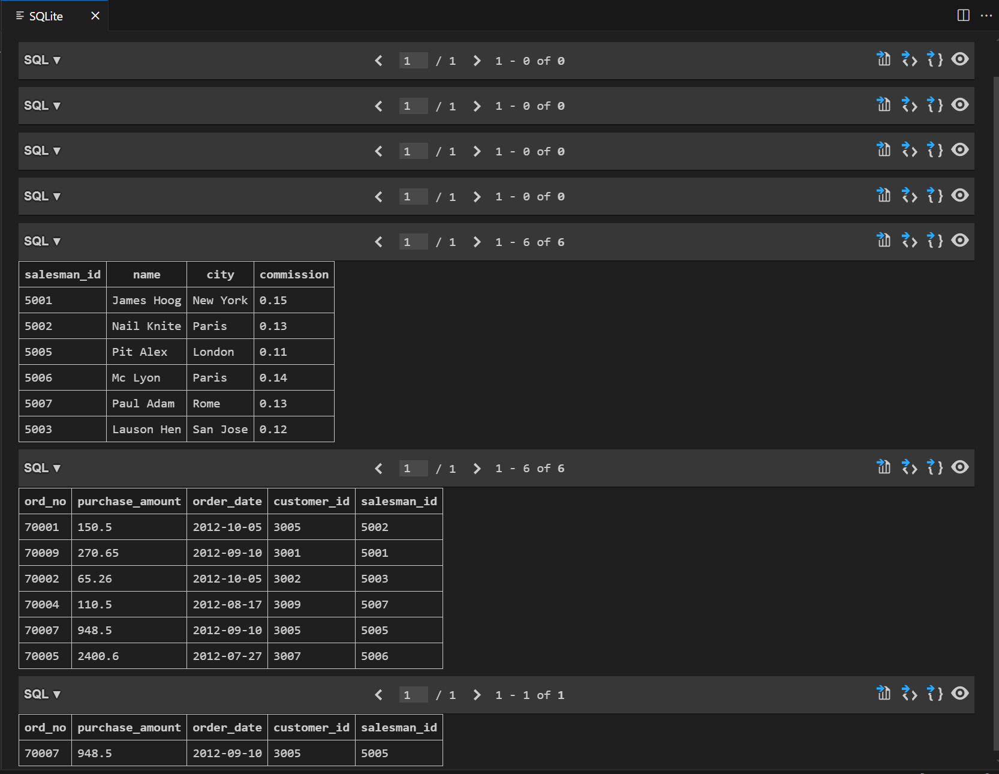

# LMS: Grade 9-12

## M12- SQL using Python - I

## SQL1 Activity 

### Problem Statement
Create two tables "Salesman" & "Orders" and then write a query to display all the orders for the salesman who belongs to the city London

### Output

