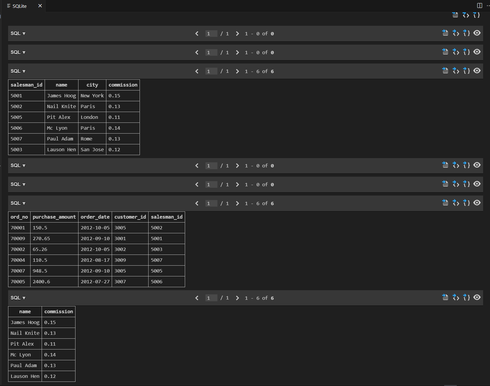

# LMS: Grade 9-12

## M12- SQL using Python - I

## SQL1 Activity: Salesman and Orders Table

### Problem Statement
Write a query to display only name and commission from table Salesman.

### Output

